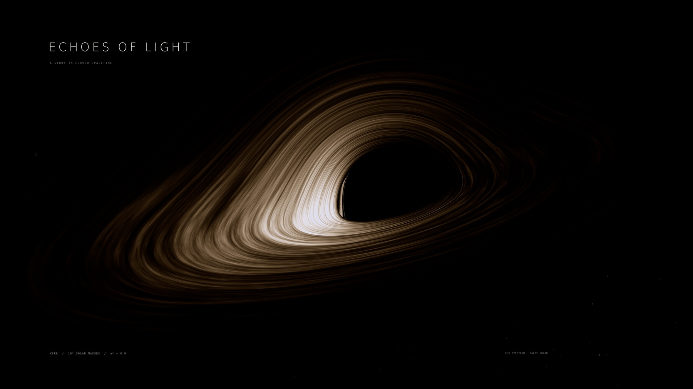

# ECHOES OF LIGHT

An interactive Kerr black hole observatory. Light propagation, disk visibility, frequency shifts, and delayed images come from a shared numerical model.



## Explore

Drag to orbit, scroll or pinch to zoom, and tap to inspect a ray. Pause or scrub time, isolate lensed echoes and the moving filament, choose a spectral camera, or follow the guided orbit. The selected rendering resolution stays fixed while moving. Choose Fast on lighter devices and Fine for closer inspection.

The visualization runs entirely in the browser with WebGL 2 and floating-point color buffers. No account, application server, external JavaScript dependency, or API key is required.

## Run locally

Open `index.html`, or serve this directory:

```sh
python3 -m http.server 8317 --bind 127.0.0.1
```

Then open http://127.0.0.1:8317. Python is only needed for the optional local server and offline scientific tools.

## Physical model

- 100 million solar masses; Kerr spin a* = 0.9.
- Prograde, opaque, equatorial thin disk beginning at the ISCO.
- Numerical null geodesics, combined gravitational and Doppler frequency shifts, and retarded emission times.
- Novikov–Thorne baseline flux with a procedural turbulent heating field, rather than an MHD simulation.
- Explicitly labeled EUV false color, plus an actual visible-band camera option.

Read [the live rendering notes](LIVE-NOTES.md) and [the physical assumptions](PHYSICS.md). Narrow higher-order images remain subject to finite precision and pixel sampling. The guided orbit interpolates distant observer directions; it is not a solved moving-camera worldline.

## Source and verification

`live/app.js` implements interaction and GPU orchestration. `live/shaders.js` contains the geodesic, emission, and display shaders. `live/build_tables.py` rebuilds the physical lookup tables. The C++ and Python sources reproduce the offline reference calculation.

[live-verification.json](live-verification.json) records seven camera grids with 71,680 GPU rays and 1,939 reference comparison samples. [interaction-verification.json](interaction-verification.json) records local UI checks and their limits. Source and numerical evidence accompany the 6K stills.

## Hosting

This is a buildless static website. GitHub Pages publishes the root of `main`; `.nojekyll` keeps all assets intact. Relative asset paths also support other static hosts.
